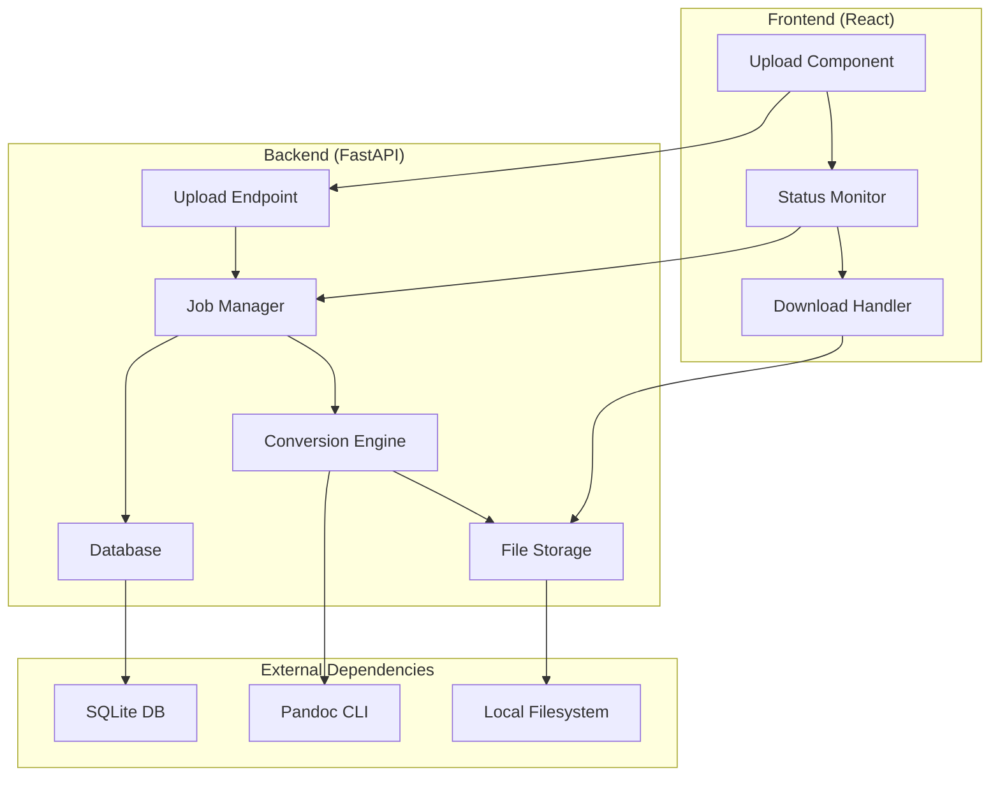

# Design Document: File Converter

## Overview

The File Converter is a full-stack web application that enables users to upload Microsoft Word documents and receive converted PDF files. The system consists of a React frontend for user interaction and a FastAPI backend for file processing, utilizing Pandoc for document conversion and SQLite for job tracking.

The architecture follows a job-based processing model where each upload creates a trackable job with status updates, allowing users to monitor conversion progress and download completed files.

## Architecture

### System Components



### Technology Stack

**Frontend:**
- React 18+ with functional components and hooks
- Axios for HTTP requests with upload progress tracking
- CSS modules or styled-components for responsive styling
- File validation and drag-and-drop support

**Backend:**
- FastAPI with Python 3.8+
- SQLAlchemy for database ORM
- python-multipart for file upload handling
- subprocess for Pandoc CLI integration
- uvicorn as ASGI server

**Storage & Processing:**
- SQLite for job metadata and status tracking
- MinIO for object storage of temporary and converted files
- Pandoc CLI for DOCX to PDF conversion

## Components and Interfaces

### Frontend Components

#### UploadComponent
```typescript
interface UploadComponentProps {
  onUploadComplete: (jobId: string) => void;
}

interface UploadState {
  selectedFile: File | null;
  uploadProgress: number;
  isUploading: boolean;
  error: string | null;
}
```

**Responsibilities:**
- File selection with DOCX validation
- Upload progress visualization
- Error handling and user feedback
- Integration with backend upload API

#### StatusMonitor
```typescript
interface Job {
  id: string;
  filename: string;
  status: 'pending' | 'processing' | 'completed' | 'failed';
  createdAt: string;
  completedAt?: string;
  errorMessage?: string;
}

interface StatusMonitorProps {
  refreshInterval?: number;
}
```

**Responsibilities:**
- Periodic status polling from backend
- Job list display with status indicators
- Real-time updates for job progress
- Download link management

#### DownloadHandler
```typescript
interface DownloadHandlerProps {
  jobId: string;
  filename: string;
  onDownloadComplete?: () => void;
}
```

**Responsibilities:**
- PDF file download initiation
- Download progress tracking
- Error handling for failed downloads

### Backend Components

#### API Endpoints

**Upload Endpoint**
```python
@app.post("/upload")
async def upload_file(file: UploadFile = File(...)) -> UploadResponse:
    """
    Accepts DOCX file upload and creates conversion job
    Returns: {"job_id": str, "status": str}
    """
```

**Status Endpoint**
```python
@app.get("/status/{job_id}")
async def get_job_status(job_id: str) -> JobStatusResponse:
    """
    Returns current job status and metadata
    Returns: {"job_id": str, "status": str, "filename": str, "created_at": str, ...}
    """
```

**Download Endpoint**
```python
@app.get("/download/{job_id}")
async def download_file(job_id: str) -> FileResponse:
    """
    Serves converted PDF file for download
    Returns: PDF file stream with appropriate headers
    """
```

#### JobManager
```python
class JobManager:
    def create_job(self, filename: str, file_path: str) -> str
    def update_status(self, job_id: str, status: JobStatus) -> None
    def get_job(self, job_id: str) -> Job | None
    def list_jobs(self) -> List[Job]
    def cleanup_expired_jobs(self) -> None
```

**Responsibilities:**
- Job lifecycle management
- Database operations for job metadata
- Status tracking and updates
- Cleanup of expired jobs

#### ConversionEngine
```python
class ConversionEngine:
    def convert_docx_to_pdf(self, input_path: str, output_path: str) -> ConversionResult
    def validate_docx_file(self, file_path: str) -> bool
    def get_conversion_command(self, input_path: str, output_path: str) -> List[str]
```

**Responsibilities:**
- Pandoc CLI integration
- File format validation
- Conversion error handling
- Output quality optimization

#### FileStorage
```python
class FileStorage:
    def __init__(self, minio_client: Minio, bucket_name: str):
        self.client = minio_client
        self.bucket = bucket_name
    
    def save_upload(self, file: UploadFile, job_id: str) -> str
    def get_converted_file_url(self, job_id: str) -> str
    def cleanup_job_files(self, job_id: str) -> None
    def ensure_bucket_exists(self) -> None
```

**Responsibilities:**
- MinIO object storage integration
- Temporary file management in object storage
- Converted file storage and URL generation
- File cleanup operations

## Data Models

### Database Schema

```sql
CREATE TABLE jobs (
    id VARCHAR(36) PRIMARY KEY,
    filename VARCHAR(255) NOT NULL,
    original_size INTEGER NOT NULL,
    status VARCHAR(20) NOT NULL DEFAULT 'pending',
    created_at TIMESTAMP DEFAULT CURRENT_TIMESTAMP,
    started_at TIMESTAMP NULL,
    completed_at TIMESTAMP NULL,
    error_message TEXT NULL,
    file_path VARCHAR(500) NOT NULL,
    output_path VARCHAR(500) NULL
);

CREATE INDEX idx_jobs_status ON jobs(status);
CREATE INDEX idx_jobs_created_at ON jobs(created_at);
```

### Pydantic Models

```python
class JobStatus(str, Enum):
    PENDING = "pending"
    PROCESSING = "processing"
    COMPLETED = "completed"
    FAILED = "failed"

class Job(BaseModel):
    id: str
    filename: str
    original_size: int
    status: JobStatus
    created_at: datetime
    started_at: Optional[datetime] = None
    completed_at: Optional[datetime] = None
    error_message: Optional[str] = None
    file_path: str
    output_path: Optional[str] = None

class UploadResponse(BaseModel):
    job_id: str
    status: str
    message: str

class JobStatusResponse(BaseModel):
    job_id: str
    filename: str
    status: JobStatus
    created_at: datetime
    completed_at: Optional[datetime] = None
    error_message: Optional[str] = None
```

### File System Structure

```
MinIO Buckets:
├── file-converter/           # Main bucket
│   ├── uploads/             # Temporary DOCX files
│   │   └── {job_id}.docx
│   └── converted/           # Generated PDF files
│       └── {job_id}.pdf

Local Filesystem:
├── /app
│   ├── logs/               # Application logs
│   └── database/           # SQLite database file
│       └── jobs.db
```

## Correctness Properties

*A property is a characteristic or behavior that should hold true across all valid executions of a system-essentially, a formal statement about what the system should do. Properties serve as the bridge between human-readable specifications and machine-verifiable correctness guarantees.*

### Property 1: File Validation and Upload Processing
*For any* uploaded file, the system should accept only valid DOCX files within size limits, create unique job IDs, and store files with proper organization to prevent conflicts.
**Validates: Requirements 1.2, 3.1, 3.2, 6.1, 6.5**

### Property 2: Job Status Lifecycle Management
*For any* conversion job, status transitions should follow the correct sequence (pending → processing → completed/failed), with proper timestamp updates and database persistence.
**Validates: Requirements 3.4, 3.5, 5.2, 5.3**

### Property 3: API Endpoint Correctness
*For any* valid API request, endpoints should return appropriate responses with correct status codes, proper JSON structure, and handle invalid inputs with appropriate error responses.
**Validates: Requirements 4.1, 4.2, 4.3, 4.4, 4.5**

### Property 4: Conversion Process Integrity
*For any* valid DOCX file, the conversion process should produce a valid PDF file, store it in the correct location, and update job status appropriately upon completion or failure.
**Validates: Requirements 3.3, 3.4, 3.5, 6.2**

### Property 5: Frontend Status Display Consistency
*For any* job status data, the frontend should display all jobs with correct status information, show download links only for completed jobs, and display appropriate error messages for failed jobs.
**Validates: Requirements 2.1, 2.2, 2.3, 2.5, 7.4**

### Property 6: Upload Progress and Response Handling
*For any* file upload operation, the frontend should display progress correctly, handle successful uploads by showing job IDs, and trigger appropriate API calls on user interactions.
**Validates: Requirements 1.3, 1.4, 1.5, 2.4, 7.2**

### Property 7: File Cleanup and Storage Management
*For any* completed or expired job, the system should clean up temporary files appropriately while maintaining converted files for download, and handle storage errors gracefully.
**Validates: Requirements 6.3, 6.4**

### Property 8: Concurrent Processing Safety
*For any* set of simultaneous operations, the system should handle concurrent uploads, conversions, and database operations without conflicts or data corruption.
**Validates: Requirements 8.1, 8.2, 8.3, 8.4**

### Property 9: Database Query Accuracy
*For any* job query, the database should return accurate and current job information with all required metadata fields properly populated.
**Validates: Requirements 5.1, 5.4**

<function_calls>
<invoke name="prework">
<parameter name="featureName">file-converter

## Error Handling

### Frontend Error Handling

**File Validation Errors:**
- Invalid file type: Display clear message with supported formats
- File size exceeded: Show size limit and suggest compression
- Network errors: Provide retry options with exponential backoff

**Upload Errors:**
- Connection timeout: Automatic retry with progress preservation
- Server errors: Display user-friendly messages with error codes
- Authentication issues: Redirect to login or refresh session

**Status Polling Errors:**
- API unavailable: Graceful degradation with cached status
- Invalid job ID: Clear error message with navigation options
- Timeout errors: Retry mechanism with user notification

### Backend Error Handling

**File Processing Errors:**
```python
class ConversionError(Exception):
    def __init__(self, message: str, error_code: str, job_id: str):
        self.message = message
        self.error_code = error_code
        self.job_id = job_id

# Error categories:
# - INVALID_FILE: Corrupted or unsupported DOCX format
# - CONVERSION_FAILED: Pandoc conversion error
# - STORAGE_ERROR: File system operation failure
# - RESOURCE_LIMIT: Memory or disk space exceeded
```

**Database Error Handling:**
- Connection failures: Retry with exponential backoff
- Constraint violations: Proper error responses with details
- Transaction rollback: Ensure data consistency on failures

**Pandoc Integration Errors:**
- Command execution failures: Capture stderr and log details
- Timeout handling: Kill long-running processes gracefully
- Resource exhaustion: Queue management and rate limiting

### Error Response Format

```json
{
  "error": {
    "code": "CONVERSION_FAILED",
    "message": "Unable to convert document",
    "details": "Pandoc reported: Invalid DOCX structure",
    "job_id": "uuid-here",
    "timestamp": "2024-01-02T10:30:00Z"
  }
}
```

## Testing Strategy

### Dual Testing Approach

The system will employ both unit testing and property-based testing to ensure comprehensive coverage:

**Unit Tests:**
- Specific examples demonstrating correct behavior
- Edge cases and error conditions
- Integration points between components
- API endpoint functionality with known inputs

**Property-Based Tests:**
- Universal properties across all valid inputs
- Comprehensive input coverage through randomization
- Minimum 100 iterations per property test
- Each test tagged with corresponding design property

### Property-Based Testing Configuration

**Testing Framework:** Hypothesis (Python) for backend, fast-check (TypeScript) for frontend

**Test Configuration:**
```python
# Backend property tests
@given(st.binary(min_size=1024, max_size=10*1024*1024))
@settings(max_examples=100, deadline=30000)
def test_file_upload_property(file_data):
    """
    Feature: file-converter, Property 1: File Validation and Upload Processing
    """
    # Test implementation
```

```typescript
// Frontend property tests
fc.test(fc.property(
  fc.string({ minLength: 1, maxLength: 255 }),
  fc.constantFrom('pending', 'processing', 'completed', 'failed'),
  (filename, status) => {
    // Feature: file-converter, Property 5: Frontend Status Display Consistency
    // Test implementation
  }
), { numRuns: 100 });
```

### Testing Environments

**Local Development:**
- SQLite in-memory database for fast test execution
- Mock Pandoc CLI for unit tests
- Temporary directories for file operations

**Integration Testing:**
- Real Pandoc installation for conversion testing
- File system operations with cleanup
- Database persistence validation

**Load Testing:**
- Concurrent upload simulation
- Memory usage monitoring
- Performance regression detection

### Test Data Management

**File Fixtures:**
- Valid DOCX samples with various content types
- Invalid files for error testing
- Large files for performance testing
- Corrupted files for robustness testing

**Database Fixtures:**
- Job records in various states
- Timestamp edge cases
- Concurrent modification scenarios

### Continuous Integration

**Pre-commit Hooks:**
- Property test execution
- Code formatting and linting
- Type checking for TypeScript/Python

**CI Pipeline:**
- Full test suite execution
- Integration test with real Pandoc
- Performance benchmark comparison
- Security vulnerability scanning